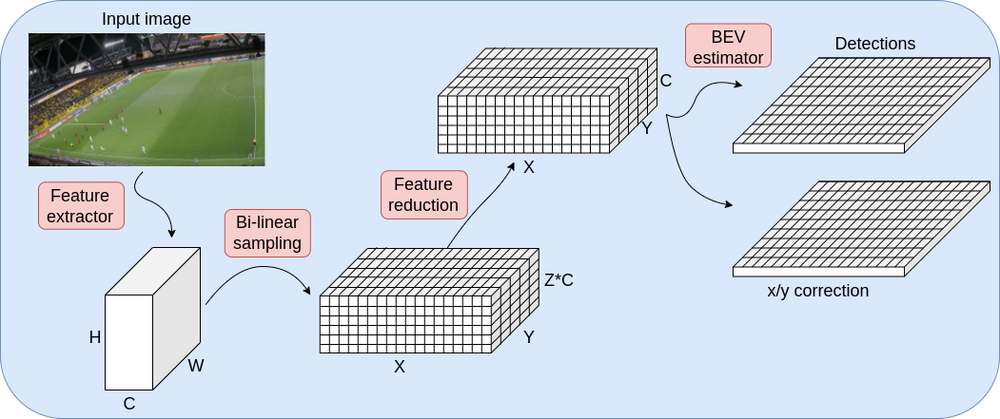

# SPL-BEV
Implementation of the paper SPL-BEV: Soccer Player Localization and Birds-Eye-View Estimation.

In this work we present SPL-BEV, a method to localize soccer players on a pitch from a monocular RGB camera. SPL-BEV features a network with few parameters that does not need to make any explicit object detection before localization is made. With SPL-BEV we show increased performance on the Spiideo SoccerNet SynLoc dataset compared to the best provided baseline result. The SPL-BEV system samples features from the U-Net feature space using bi-linear interpolation, guided by camera calibration, to generate features at grid points across multiple planes in a 3D world coordinate system. This forms a voxel feature space, which is then processed into grid cell detections on the ground plane, with final location refinement through x/y correction.




Code, instructions etc comming soon!

## Cite
If you use our work, please cite:
```bibtex
@InProceedings{persson2025SPLBEV,
author="Persson, Ivar and Ard{\"o}, H{\aa}kan and Nilsson, Mikael",
title="SPL-BEV: Soccer Player Localization and Birds-Eye-View Estimation",
booktitle="Computer Analysis of Images and Patterns",
year="2026",
publisher="Springer Nature Switzerland",
address="Cham",
pages="114--123",
isbn="978-3-032-04968-1"
}

